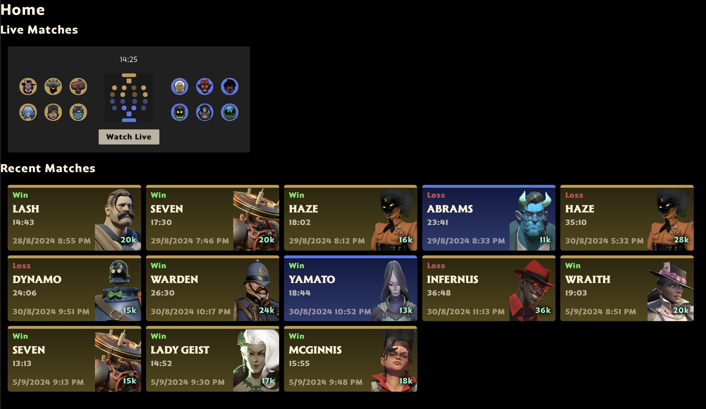
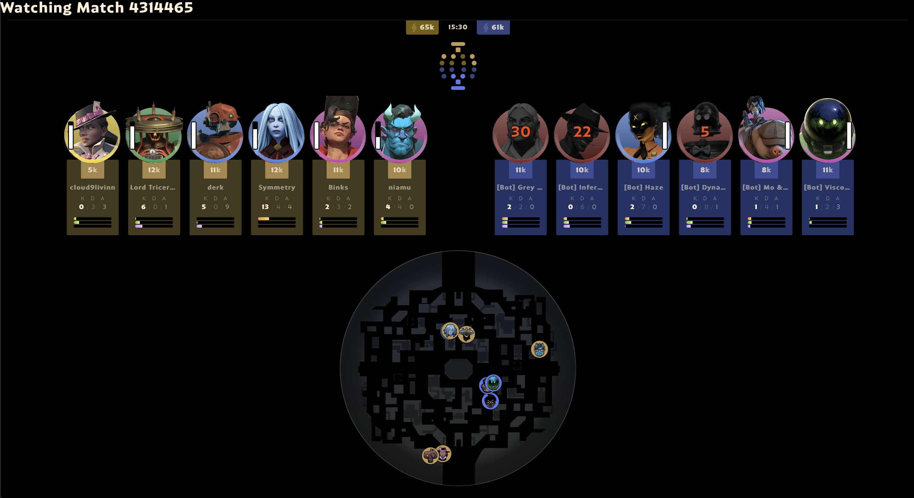

# Healbane

A [Deadlock](https://playdeadlock.com) web server that parses meta replay files and renders them with replicated in-game components. Meta replay files are loaded from `defs/replays/`.

## Screenshots

### Home

### Live Match

### Post Game

## Starting the Server

To start the server:

  * Run `mix setup` to install and setup dependencies
  * Start Phoenix endpoint with `STEAM_API_KEY=XXX mix phx.server` or inside IEx with `STEAM_API_KEY=XXX iex -S mix phx.server`

Now you can visit [`localhost:4000`](http://localhost:4000) from your browser.
